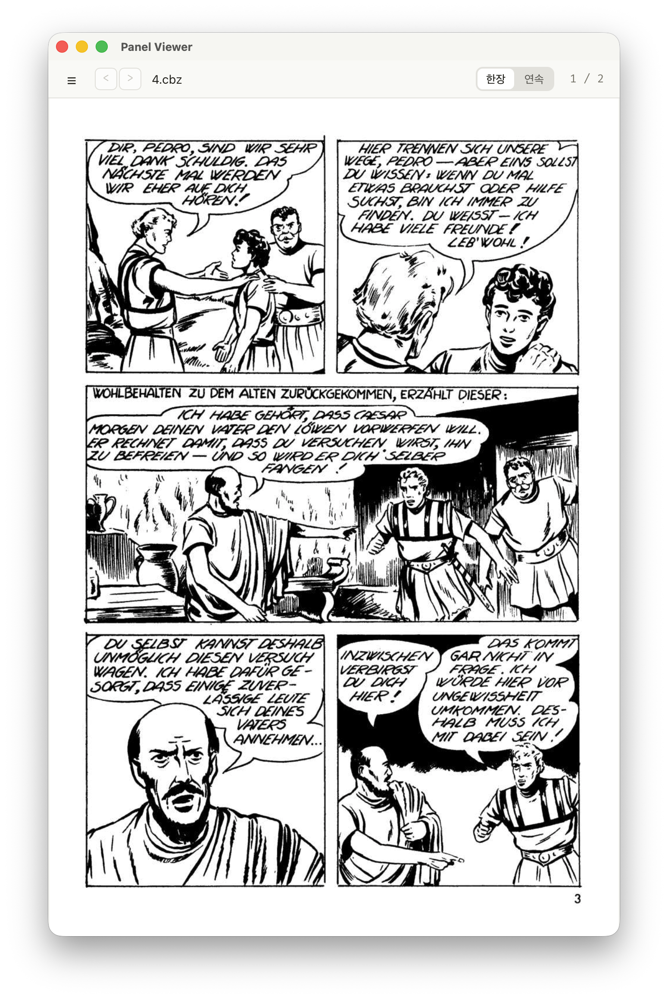

# Panel Viewer

**Tauri 2 + React + TypeScript** 기반의 macOS 데스크톱 만화/웹툰 뷰어입니다. `cbz` · `cbr` · `zip` 아카이브를 열어 페이지를 읽고, 왼쪽 파일 패널로 폴더를 탐색합니다.

<p align="center">
  
</p>

> 개발·검증은 **macOS 우선**입니다. Tauri 설정은 크로스플랫폼이지만 macOS에서만 실제로 검증합니다.

## 주요 기능

- **아카이브 읽기** — `cbz` · `cbr` · `zip`. 형식은 확장자가 아닌 **매직 바이트**로 판별(예: 실제로 RAR인 `.cbz`도 열림).
- **두 가지 보기 모드** — `한장`(한 페이지씩) / `연속`(세로 스크롤).
- **이미지 맞춤** — 한장: 원본 · 폭 맞추기 · 높이 맞추기 · 화면에 맞추기 / 연속: 원본 · 폭 맞추기. 설정에 저장.
- **파일 패널** — 폴더 탐색 + 이미지 파일은 썸네일, 아카이브는 OS 파일 아이콘 표시. 아카이브 클릭으로 바로 열기. 표시/숨김 토글.
- **히스토리** — 파일 패널을 `히스토리` 탭으로 전환하면 지금까지 연 파일이 최신순으로. 클릭해서 열기, 항목별 삭제, 전체 리셋, 페이징(상한 500).
- **이전/다음 파일(화) 이동** — 툴바 버튼 + 단축키. 현재 폴더의 아카이브 목록 기준.
- **파일 이어보기** — 옵션. 마지막 페이지에서 다음으로 넘기면 다음 파일을, 첫 페이지에서 이전으로 넘기면 이전 파일(마지막 페이지)을 자동으로 연다. 한장·연속 두 모드.
- **마지막 파일 열기** — 옵션(기본 켬). 앱을 그냥 실행하면 마지막에 읽던 파일을 자동으로 연다.
- **드래그 앤 드롭** — 창에 파일을 끌어다 놓아 열기.
- **파일 연결** — `cbz` · `cbr` 더블클릭으로 앱 실행/열기(열린 파일의 폴더를 현재 폴더로 동기화).
- **마우스 휠 페이지 넘김** — 한장 모드에서 휠 아래/위로 다음/이전 페이지.
- **상태 기억** — 파일별 읽던 위치, 마지막 보기 모드·폴더, 파일 패널 숨김, **창 크기**, 이미지 맞춤, 옵션, 히스토리를 저장해 재실행 시 복원.
- **탭 설정 다이얼로그** — `일반 | 한장 | 연속 | 단축키` 4탭. 일반(마지막 파일 열기·파일 이어보기), 한장/연속(이미지 맞춤), 단축키(동작별 커스텀 키, 충돌 검사).

## 기본 단축키

| 동작 | 키 |
|------|-----|
| 다음 페이지 | `→` · `Space` · `PageDown` · 한장 모드 휠 아래 |
| 이전 페이지 | `←` · `PageUp` · 한장 모드 휠 위 |
| 처음 / 마지막 페이지 | `Home` / `End` |
| 다음 / 이전 파일(화) | `.` / `,` |
| 파일 패널 토글 | `/` |
| 앱 종료 | `x` |
| 설정(메뉴) 열기 | `⌘ ,` (고정) |
| 닫기(아카이브 → 파일 목록) | `Esc` (고정) |

표준 키는 항상 동작하며, 그 외 동작은 설정 모달에서 커스텀 키를 재지정할 수 있습니다. `⌘ ,`와 `Esc`는 고정입니다.

## 요구 사항

- **macOS**
- **Node.js**(+ npm)
- **Rust** 툴체인(`cargo`)
- **[go-task](https://taskfile.dev)** — `brew install go-task`
- CBR(RAR) 지원: `unrar` 크레이트 사용(RAR5 지원). 별도 시스템 도구 불필요.

## 시작하기

```sh
task setup   # 의존성 설치(npm install) — 최초 1회
task dev     # 앱 실행(Tauri 개발 모드, 핫리로드)
```

`task` 를 인자 없이 실행하면 사용 가능한 모든 태스크가 나열됩니다.

## 빌드

```sh
task build:app   # .app 번들만 빌드(권장). 산출물: src-tauri/target/release/bundle/macos
```

> `task build`(= 전체 번들, `.app` + `.dmg`)는 헤드리스 환경에서 DMG 단계(`bundle_dmg.sh`가 GUI/Finder 필요)가 실패할 수 있습니다. 그럴 땐 `.app`만 빌드하는 `build:app`을 쓰세요.

## 배포 (GitHub 릴리스)

버전을 올리고 `.dmg`를 빌드해 GitHub 릴리스로 업로드합니다(`scripts/release.sh`).

```sh
task release              # patch 증가 (0.1.0 → 0.1.1)
task release -- minor     # 0.1.0 → 0.2.0
task release -- major     # 0.1.0 → 1.0.0
task release -- 1.2.3     # 명시 버전
```

버전 4곳(`package.json` · `tauri.conf.json` · `Cargo.toml` · `Cargo.lock`) 갱신 → 커밋·태그(`vX.Y.Z`)·푸시 → `.dmg` 빌드 → `gh release create`(릴리스 노트 자동 생성). **요구:** `gh`(로그인)·`jq`·`perl`, 그리고 `.dmg` 번들을 위한 **macOS GUI 세션**(커밋 안 된 변경이 있으면 중단).

## 개발

```sh
task check   # 타입 체크 + 컴파일 점검 (tsc --noEmit + cargo check)
task test    # 전체 테스트 (Vitest + cargo test)
task fmt     # Rust 포맷 (cargo fmt)
task lint    # Rust 린트 (cargo clippy)
```

- 프런트 단일 테스트: `npx vitest run src/lib/nav.test.ts`
- Rust 단일 테스트: `cd src-tauri && cargo test <name>`

## 아키텍처

두 축은 **Tauri를 통해서만** 통신합니다 — 프런트는 `src/lib/api.ts`로 Rust를 호출하고, 백엔드는 커스텀 URI 스킴으로 페이지 이미지를 제공합니다.

- **Rust 백엔드** (`src-tauri/src/`)
  - `lib.rs` — 커맨드 등록, `pvpage://` 프로토콜, macOS 파일 연결 처리, 관리 상태(현재 아카이브 세션 · 영속 상태 스토어).
  - `archive.rs` — 이미지 항목 나열(자연 정렬) + 페이지 바이트 추출(zip / unrar). 형식은 매직 바이트로 판별.
  - `fs.rs` — 폴더 한 단계 나열(폴더 · 아카이브 · 이미지 각각 `kind` 태깅).
  - `state.rs` — 읽던 위치 · 보기 모드 · 마지막 폴더 · 단축키 · 창 크기 · 이미지 맞춤 · 옵션(마지막 파일 열기·이어보기) · 히스토리 등 JSON 영속화(손상 시 기본값). 순수 로직(`clamp_window_size` · `push_history`)은 단위 테스트.
  - `thumbnail.rs` — 이미지 파일 썸네일 디코드·리사이즈·디스크 캐시.
- **프런트엔드** (`src/`)
  - `lib/api.ts` — Rust로의 단일 브리지(모든 `invoke`와 백엔드 URL 빌더).
  - `lib/nav.ts` — 페이지 이동·휠 순수 로직(단위 테스트).
  - `lib/keymap.ts` — 단축키 동작·해석·충돌 검사(단위 테스트).
  - `App.tsx` — 교차 상태(아카이브 · 현재 페이지 · 보기 모드 · 폴더 목록 등)와 열기 흐름을 소유. `FilePanel` / `Viewer`(→ `PageView` / `ContinuousView`)가 표현 담당.

페이지 이미지는 `pvpage://localhost/<index>?v=<token>` 커스텀 프로토콜로 제공됩니다(토큰은 파일 전환 시 캐시 무효화용).

## 기술 스택

- Tauri 2 · React 19 · TypeScript 5.8 · Vite 7 · Vitest 3
- Rust: `zip` · `unrar`(RAR5) · `image` · `systemicons` · `serde`

## 프로젝트 문서

- `CLAUDE.md` — 저장소 작업 가이드(명령어 · 아키텍처 seam · 불변식).
- `DESIGN.md` — 디자인 토큰/방향.
- `scripts/release.sh` — 릴리스 배포 스크립트(`task release`).
- `.forge/` — 도메인 용어(`CONTEXT.md`), 결정 기록(`adr/`), 작업 이력(`done/`).
